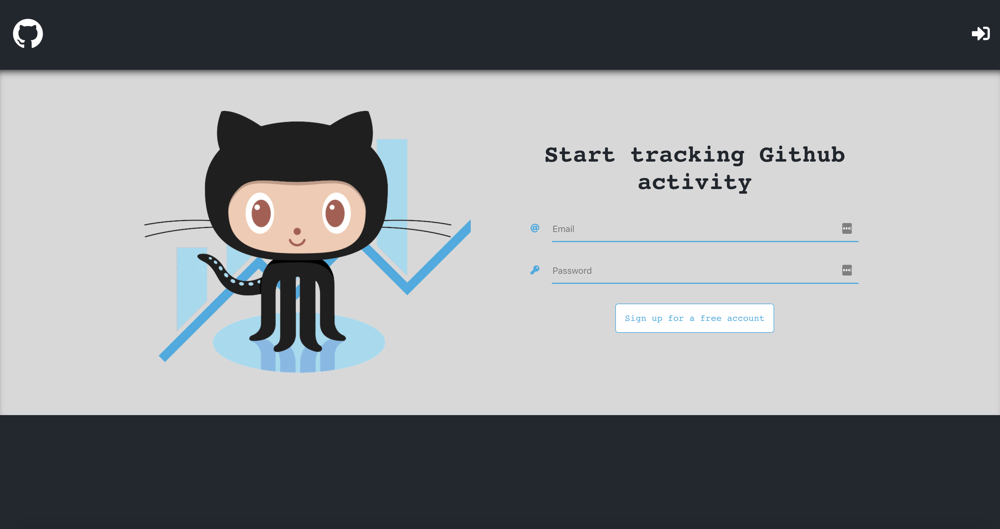
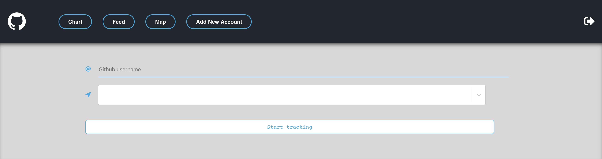

# README
## Project 2: GitHub Account Activity Monitor 

### Getting Started
This program allows multiple users to track thier freinds, co-workers, or students GitHub activity through a simplistic and easy to use program interface. The program itself currently consist of 5 main pages. The first of being the login page, simply go 
[here](https://github-activity-monitor-app.herokuapp.com/) to get started! Once their you will see a page that looks like the image below:

Once you have created an account the session manager will automatically save all the edits you make within your session. It will also every 24 hours check for updates from the accounts you choose to follow/track. 

### Adding Accounts

